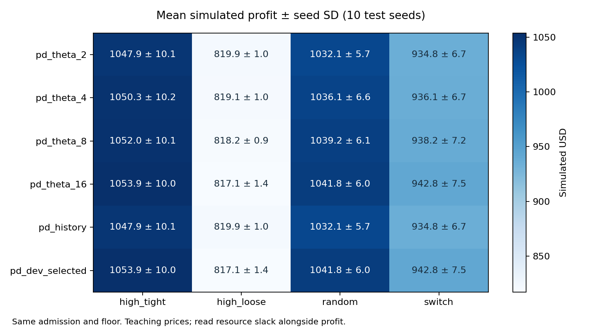

# EdgeInferenceLab

A reproducible learning study of edge AI inference scheduling.

**Follow a research question from paper reading and recent related work to explicit assumptions, CPU simulations, controlled experiments, and evidence.** This project studies how pairing requested accuracy with deadlines affects instance retention while keeping their marginal distributions and the base request trace fixed.

English | [中文](README_ZH.md)

[Quick start](#quick-start) · [Research records](#research-records) · [Results](#results) · [Scope](#scope)



*Actual 24-slot results, generated from saved CSV files. Prices are teaching inputs; simulated profit must be read alongside resource slack.*

## Quick start

Python 3.9 or newer; the simulator has no external dependencies and needs no GPU, model weights, or API keys. From the project directory:

```bash
python run_lab.py --config configs/smoke.json --output results/local/smoke
```

The output directory must be new or empty. The command generates CSV/JSON metrics, representative event ledgers, provenance, and SVG plots. `results/local/` is ignored so personal reruns do not silently replace recorded results.

Run the independent 24-slot extension:

```bash
python run_lab.py --config configs/study24.json --output results/local/study24
```

Audit one saved event ledger:

```bash
python run_lab.py --audit results/study/events/test_seed101_switch_pd_theta_2.jsonl
```

Windows PowerShell tests:

```powershell
$env:PYTHONPATH = "src"
python -m unittest discover -s tests -t . -v
```

For other shells, set `PYTHONPATH=src` before the same unittest command. Optional editable installation: `python -m pip install -e .`. The source-checkout entry above works without installation.

## Research records


| Record | What a reader can inspect |
|---|---|
| [Main-paper notes](docs/reading/01-main-paper.md) | Problem, costs, online decisions, instance lifecycle, unresolved printed ambiguities |
| [Recent direction](docs/reading/02-recent-direction.md) | Liang's retraining/inference research; mechanisms deliberately outside this implementation |
| [Related work](docs/related-work.md) | Primary sources and version/status checks through 2026-09-29; overlap, limits and unverified citations |
| [Implementation map](docs/implementation-map.md) | Equations to functions, conventions, deviations and baseline meanings |
| [Experiments](docs/experiments.md) | Pairing invariants, development/test separation, metric definitions, rerun commands |
| [Findings](docs/findings.md) | Actual observations, negative results, evidence and practical limits |
| [Decision log](docs/decision-log.md) | Why candidate ideas were retained, narrowed or rejected |
| [Research summary](docs/research-summary.md) | A short entry for a research discussion |
| [Learning guide](docs/learning-guide.md) | A 4–6 week route to independently explain and reproduce the work |

## Results

The [12-slot pilot](results/study/summary.md) uses development seeds 1–3 and ten independent test seeds 101–110. All four fixed thresholds are retained; the development-selected threshold is an alias of an existing result, never a test-selected winner. The completed [24-slot extension](results/study24/summary.md) uses new development seeds 11–13 and unseen test seeds 201–210 to address the pilot's short horizon. The two stages are analyzed separately. Both select θ=16 on development data; the history rule shows no consistent improvement. See the [findings](docs/findings.md) for a ranking reversal, idle-resource costs and warm-slot violations.

The [hand-calculable retention case](data/examples/README.md) creates an extra instance, leaves it idle, and requests it again under a tight deadline. Saved ledgers show θ=2 accepts 6/8 requests and θ=4 accepts 8/8, with no capacity or warm-slot violations in this case. This mechanism example is distinct from the paired research experiment.

Reports include potential payment, admitted revenue and each cost, nominal accuracy/deadline qualification, creations/releases, idle resources, physical capacity violations and warm-slot overflow. Program runtime and peak **Python allocations** are measured separately from simulated latency; the allocation measure is not process peak RSS.

Default reports preserve eight representative ledgers from the first test seed's switch scenario. Every other run records a ledger hash and can be regenerated with `--save-all-events`. Optional publication PNG figures are generated from the CSVs by [`scripts/plot_figures.py`](scripts/plot_figures.py), which requires matplotlib; matplotlib is not needed for simulation.

Recorded profiling runs preceded final input-validation fixes. Numerical revalidation regenerates every full event hash and scalar under the final package; it leaves the original runtime measurements intact. Recheck with `python run_lab.py --verify results/study24`.

## Scope

The starting paper is [Zhang et al., IEEE TMC 2025](https://www.cs.cityu.edu.hk/~weliang/papers/ZLXJY25.pdf), coauthored by Weifa Liang. The primal-dual path implements Eq. (31)/(32) and (39)–(42) under disclosed interpretations. It is **not the authors' code, an unambiguous full reproduction, or a new algorithm**. Printed candidate-set/mode inconsistencies, pricing gaps, unit choices, initialization and resource slack are documented. No competitive ratio is inherited.

`qualified_ratio` only means nominal accuracy and simulated deadline are satisfied. It does **not** establish physically executable service under strict resource/concurrency constraints. Compare the slack metrics too. `no_control_interpretation`, `no_pre_new_only`, and `greedy_hard_cap` change more than retention and are separate interpretation/teaching baselines.

All traces are synthetic. No neural model is trained or executed; reported model accuracy is a parameter, not a measured prediction quality. The project supports research learning and falsifiable evaluation, not a claim of novelty or deployed-system gains.

## License

Project-owned code, notes and synthetic examples use the [MIT License](LICENSE). Linked papers and third-party material keep their own rights; full paper PDFs and third-party code are not redistributed.
