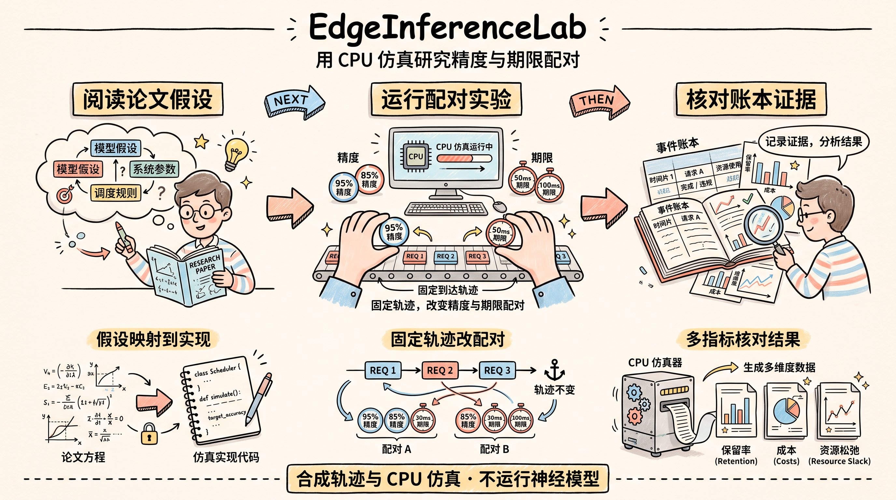

# EdgeInferenceLab

边缘 AI 推理调度的论文阅读与可复现实验记录。

**把论文阅读、近期查新、实现假设、CPU 实验和结论串成可检查的研究过程。** 项目研究：到达轨迹、模型序列及精度和期限各自分布不变时，改变二者配对关系怎样影响实例保留。

[English](README.md) | 中文

[快速开始](#快速开始) · [研究记录](#研究记录) · [真实结果](#真实结果) · [实现范围](#实现范围)


*由保存的 CSV 生成的24时间片实验图。价格为教学输入，利润需与资源松弛一起阅读。*



## 快速开始

Python 3.9+。模拟器没有第三方依赖，无需 GPU、模型权重或 API 密钥。在项目根目录运行：

```bash
python run_lab.py --config configs/smoke.json --output results/local/smoke
```

输出目录须不存在或为空。命令生成 CSV/JSON、代表性事件账本、来源元数据和 SVG 图。`results/local/`已忽略，个人复跑不会悄悄覆盖公开记录。

独立的24时间片扩展实验：

```bash
python run_lab.py --config configs/study24.json --output results/local/study24
```

从保存账本重算：

```bash
python run_lab.py --audit results/study/events/test_seed101_switch_pd_theta_2.jsonl
```

Windows PowerShell 测试：

```powershell
$env:PYTHONPATH = "src"
python -m unittest discover -s tests -t . -v
```

其他 shell 先设置`PYTHONPATH=src`，再运行相同unittest命令。可选安装：`python -m pip install -e .`；直接运行`run_lab.py`不需要安装。

## 研究记录


| 入口 | 展示的证据 |
|---|---|
| [主论文笔记](docs/reading/01-main-paper.md) | 问题、费用、在线接纳、实例生命周期和原文疑点 |
| [近期方向](docs/reading/02-recent-direction.md) | 梁維發的重训/推理方向，以及首期没有实现的机制 |
| [相关工作](docs/related-work.md) | 截至2026-09-29的原始来源、版本、状态、重叠与待核验引用 |
| [实现对照](docs/implementation-map.md) | 逐公式函数映射、歧义处理、假设和基线范围 |
| [实验协议](docs/experiments.md) | 配对不变量、开发/测试隔离、指标与复跑命令 |
| [发现](docs/findings.md) | 实际观察、负结果及结论限制 |
| [决策记录](docs/decision-log.md) | 候选想法被保留、收紧或放弃的依据 |
| [研究摘要](docs/research-summary.md) | 与老师讨论时的一页入口 |
| [学习路线](docs/learning-guide.md) | 用4–6周独立解释、手算和复做项目 |

## 真实结果

[12时间片先导实验](results/study/summary.md)使用开发种子1–3和十个独立测试种子101–110。所有固定θ均保留，开发集选定策略只是原结果别名，未用测试挑赢家。已完成的[24时间片扩展](results/study24/summary.md)改用新开发种子11–13与未用过的测试种子201–210，回应先导时域过短的问题。两个阶段分开分析，均在开发集选出θ16；历史规则未显示稳定优势。排名反转、闲置资源代价和暖槽违规见[发现](docs/findings.md)。

[手工保留案例](data/examples/README.md)包含额外实例的创建、闲置和再次访问：θ2接纳6/8，θ4接纳8/8，该例无物理容量或暖槽违规。它解释机制，与固定两个边际的主研究轨迹分开。

报告保留潜在付款、接纳收入和三项费用、标称精度/期限合格比例、创建/释放、闲置、物理容量违规和暖槽超额。本机程序耗时与峰值**Python分配内存**为实测，和模拟服务时延分开；内存值不是整个进程峰值RSS。

默认公开第一测试种子switch场景的八策略完整账本。其他运行保留事件内容哈希，可通过`--save-all-events`重生成全量账本。可选论文风格PNG由[`plot_figures.py`](scripts/plot_figures.py)从真实CSV生成，需matplotlib；模拟器本身不依赖它。

保存的性能测量来自最后一轮输入校验修正之前。数值复核用最终代码重生成每条完整事件哈希和汇总，不改写原始耗时记录。可运行`python run_lab.py --verify results/study24`复查。

## 实现范围

入口为梁維發参与的[Zhang等，IEEE TMC 2025](https://www.cs.cityu.edu.hk/~weliang/papers/ZLXJY25.pdf)。主策略按Eq.(31)/(32)、(39)–(42)实现并公开解释；**不是原作者代码、无歧义完整复现或新算法**。候选集合/mode冲突、缺失收费表、单位、初始化和资源松弛都有说明，不继承原文竞争比。

`qualified_ratio`仅表示抽象分配满足标称精度和模拟期限，**不能直接当严格物理可执行的服务完成比例**；需要同时检查容量和并发超额。取消接纳控制、零预置new-only和硬容量贪心改变了更多条件，单独作为解释或教学基线。

所有轨迹为合成数据，没有训练或执行神经网络。模型精度是输入参数，不是实测预测质量。项目支持学习与可证伪评估，不宣称已确认论文创新或真实部署收益。

## 许可证

自有代码、笔记和合成示例采用[MIT](LICENSE)。链接论文及第三方资料保留各自权利，项目不重新分发整篇PDF或第三方代码。
