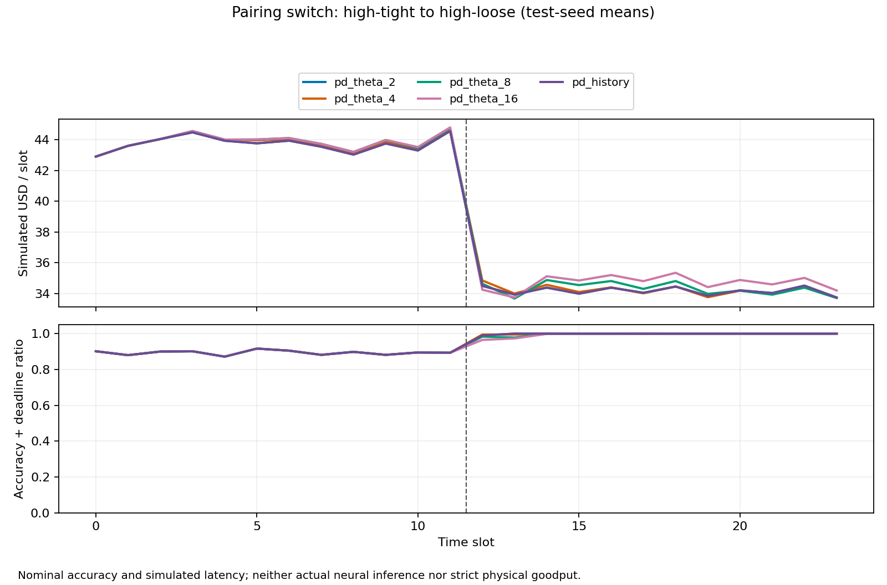

# 已取得的证据及局限

日期：2026-09-29。以下数字来自保存结果，不是预期提升。结论限定于当前公开配置、合成请求和公式解释。

## 1. 能运行，但还不是原作者的完整复现

主实现按原文候选、折减利润及对偶更新公式运行；模型参数有原表来源、单位、人为收费和中点取值说明。原文的集合/mode、零预置、L因子和收费缺项阻止无歧义完整复现。因此采用“公式指导、假设公开的学习重实现”，不套用原文竞争比。[对照表](implementation-map.md)。

共完成12时间片先导及24时间片扩展，各有3个开发、10个测试工作负载种子。网络固定，不是10个随机拓扑。两批测试互不重合；未混合均值或利用旧测试为新批选θ。[先导](../results/study/metadata.json)、[扩展](../results/study24/metadata.json)。

## 2. 同样两个边际，保留策略的排序仍会改变

24时间片的同轨迹比较如下，金额为模拟美元：

| 配对关系 | θ2利润均值 | θ16利润均值 | θ2−θ16 | θ2闲置vCPU均值 | θ16闲置vCPU均值 |
|---|---:|---:|---:|---:|---:|
| high_tight | 1047.906 | 1053.882 | −5.976 | 13.000 | 30.504 |
| high_loose | 819.873 | 817.051 | +2.822 | 10.352 | 36.258 |
| random | 1032.090 | 1041.811 | −9.721 | 13.783 | 42.550 |
| switch | 934.840 | 942.849 | −8.010 | 11.481 | 31.796 |

来源：[aggregate.csv](../results/study24/aggregate.csv)、[逐种子配对差值](../results/study24/paired_differences.csv)。四固定θ都保存，开发集按四场景平均利润选出θ16。θ2在high_loose利润较高，但其他情形较低；这支持“当前设定下保留策略的效果依赖联合需求”的具体观察，不能推出普遍最优阈值或新算法优势。

更长保留减少创建，却明显增加闲置；原目标没有闲置租赁费，不能把多保留当经济上免费，更不能自加费用后仍称原文利润。当前只测一套容量/费用/初始化设定，没有显著性检验、最优解或真实部署对比。

## 3. 配对也改变了可收取的付款

扩展的潜在付款均值：high_tight为1429.320，high_loose为1002.660，random为1213.320，switch为1216.140。两边际保持相同，阶梯函数仍因联合组合改变输入价值；例如高精度+紧期限的收费更高。跨列绝对利润差不能全部解释为保留策略因果效应。比较依据是同一轨迹上的策略差值，辅以收入、费用和可行性分解。

固定slot12由high_tight切到high_loose后，标称精度/期限合格比例上升、每槽利润下降；这不能简单叫性能退化，因为配对同时改变付款机会和可行服务组成。图来自[slot_metrics.csv](../results/study24/slot_metrics.csv)。**未做切换顺序或相位的独立对照**，不能回答切换时机H2。

## 4. 历史变体几乎未形成不同的留存行为

先导52条开发/测试场景中，`pd_history`与θ2的完整事件哈希一致。有些受保护floor组的历史阈值改变，但floor不会被淘汰；可淘汰实例未形成行为差异。这是当前数据没有有效触发机制差异，不是证明历史统计没有价值。

24时间片扩展中50/52条完整账本仍相同。例外仅为测试206和207的high_tight；206利润相同，207历史变体较θ2多约0.0994模拟美元。没有稳定改善证据，也未超过开发选出的固定策略。当前不提出精度/期限感知保留的新算法。

## 5. 高接纳率必须与资源松弛一起读

high_tight下θ2/θ16的标称精度/期限合格比例均约0.893，但每条测试轨迹平均暖槽超额总量为128。它们并非在严格L约束下实现了这些完成服务。No_control的更高模拟接纳不能当合法吞吐优势。物理容量与暖槽限制是两个不同账本，均已记录。

手工例是更干净的机制证据：同样8请求，θ2接纳6、净利润2.819976；θ4接纳8、净利润4.159968；无物理或暖槽违规。原因是slot2末释放的额外实例不能帮助slot3的紧期限请求；保留实例则可。[输入与解释](../data/examples/README.md)、[θ2账本](../results/case-theta2/events.jsonl)、[θ4账本](../results/case-theta4/events.jsonl)。该轨迹不是主配对控制实验，不混用结论。

## 6. CPU成本与可复现性

Windows、Python3.9.25的已记录运行：

| 运行 | 程序耗时 | tracemalloc峰值Python分配 |
|---|---:|---:|
| smoke | 4.817秒 | 1.61MiB |
| 12时间片，全部开发/测试策略 | 203.366秒 | 10.86MiB |
| 24时间片，全部开发/测试策略 | 479.164秒 | 17.14MiB |

数值来自各目录metadata，含内存跟踪及报告开销，不是模型推理速度或整个进程RSS；本机同时进行其他工作，不能承诺另一电脑的耗时。24片单配置仍低于提案10分钟缩规模门槛，不保证原论文规模。

最终审阅修正了未使用支付项污染界、CSV静默丢列/覆盖、极小格点归零、非法容器与数值边界报错。原有有效配置的数值通过**全量事件哈希与汇总重生成**复核；原性能记录保留其实际测量版本，不改写历史。复核文件见[先导](../results/verification-pilot.json)与[扩展](../results/verification-study24.json)。测试覆盖手算、生命周期、配对、账本、CLI及这些输入缺陷。

## 7. 下一步讨论问题

与老师讨论前，需本人能手算和解释上述机制。更具体的后续问题是：**在严格物理容量/服务槽约束下，固定两个边际的配对效应是否仍存在，哪些实例真正因精度与期限需求获得保留价值？** 后续需要匹配的严格资源实现、更强历史基线、不同初始容量和初始化代价，以及作者对原文歧义的澄清。尚未实现，也尚未通过查新证明这些问题是空白。

近期工作已覆盖质量/期限/缓存、预测驱逐和请求组成变化。当前直接引文核验仍不完整，不能以“未搜到同样实验”证明新颖。[查新证据与限制](related-work.md)。
